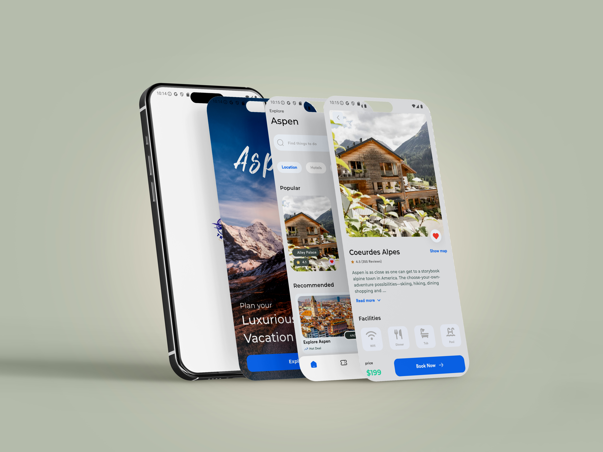
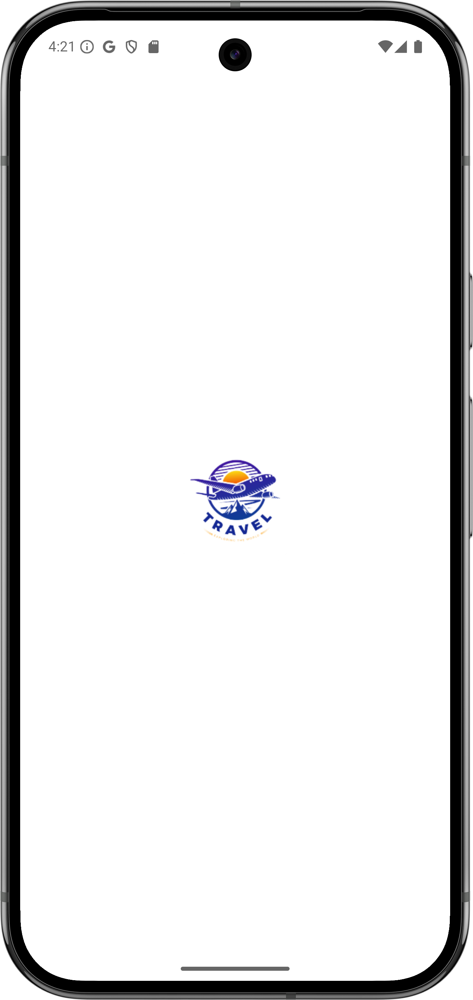
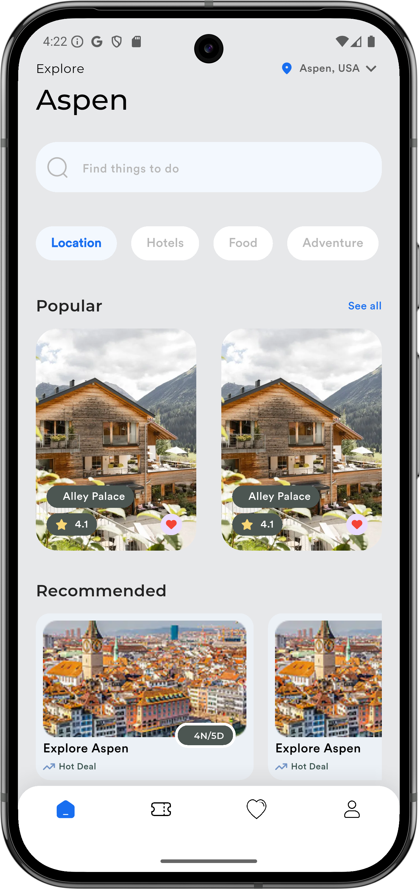
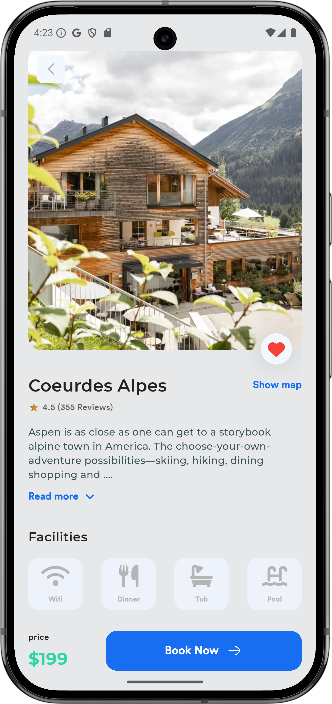

# Aspen Travel App
[](https://deepwiki.com/Nidhal-Khazene/Aspen_Travel_Mobile_App)

A travel and tourism mobile application built with Flutter, based on a UI design for "Aspen." The app allows users to explore popular destinations, view location details, and browse recommendations within Aspen.



## UI/UX Design

This project is a Flutter implementation of the "Aspen Travel App" design from Figma.

*   **[Figma Design Link](https://www.figma.com/design/ATSanvu22TlitQAZC3Jnij/Aspen-Travel-App-Exploration--Mobile-App-Design--Community-?node-id=0-1&p=f&t=P7ucqJdqrLKuf1fx-0)**

## Youtube Video

*   **[Youtube Video Link](https://youtu.be/WD0P_xho_Wk?si=nJiKUu2FDJ60yLsS)**

## Features

*   **Splash Screen:** An engaging entry screen with app branding.
*   **Home Screen:**
    *   Displays popular and recommended travel spots.
    *   A search bar to find things to do.
    *   Dynamic category filters (Location, Hotels, Food, Adventure).
    *   Custom bottom navigation to switch between app sections.
*   **Location Details:**
    *   A detailed view for each location with a high-quality image gallery.
    *   Information including ratings, reviews, and a full description.
    *   A list of available facilities (e.g., Wifi, Dinner, Pool).
    *   Pricing and a "Book Now" call-to-action.

## Screenshots

|                             Icon Launch Screen                              |                                 Splash Screen                                 |
|:---------------------------------------------------------------------------:|:-----------------------------------------------------------------------------:|
|  |  |

|                                Home Screen                                |                                 Location Details                                  |
|:-------------------------------------------------------------------------:|:---------------------------------------------------------------------------------:|
|  |  |


## Technologies & Libraries

*   **Framework:** Flutter
*   **Language:** Dart
*   **Key Packages:**
    *   `flutter_svg`: To render SVG images.
    *   `font_awesome_flutter`: For a wide range of icons.
    *   `iconsax_flutter`: For additional modern icons.
    *   `flutter_launcher_icons`: To automate the generation of app launcher icons.

## Project Structure

The project is structured following a feature-first approach to maintain scalability and organization.

```
lib/
├── core/
│   ├── helper/       # Navigation and route generation
│   ├── utils/        # Shared constants (assets, colors, text styles)
│   └── widgets/      # Reusable custom widgets (e.g., CustomButton)
├── features/
│   ├── home/         # Home screen, location details, and related widgets
│   └── splash/       # Splash screen UI and logic
├── main.dart         # Main application entry point
└── constants.dart    # Global constants
```

## Getting Started

To run this project locally, follow these steps:

1.  **Clone the repository:**
    ```sh
    git clone https://github.com/Nidhal-Khazene/Aspen_Travel_Mobile_App.git
    ```

2.  **Navigate to the project directory:**
    ```sh
    cd Aspen_Travel_Mobile_App
    ```

3.  **Install dependencies:**
    ```sh
    flutter pub get
    ```

4.  **Run the application:**
    ```sh
    flutter run
    ```

## License

This project is licensed under the MIT License. See the [LICENSE](LICENSE) file for details.

---

*Copyright (c) 2025 Nidhal Khazene*